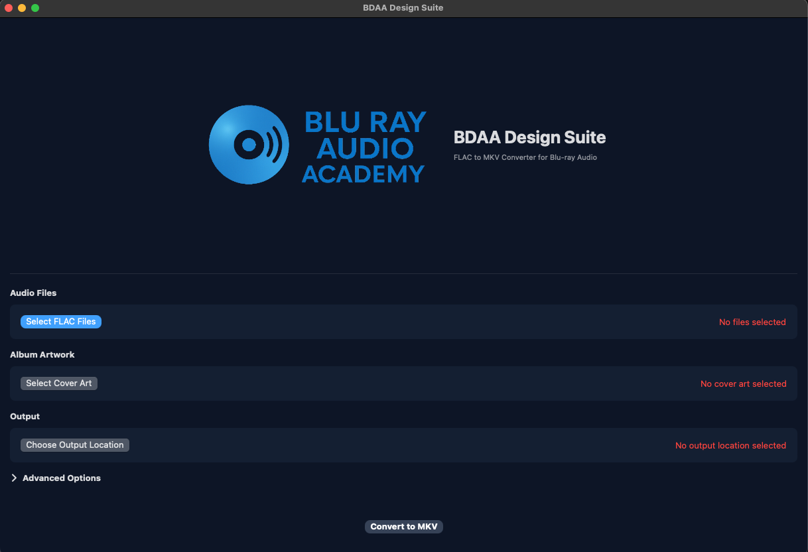
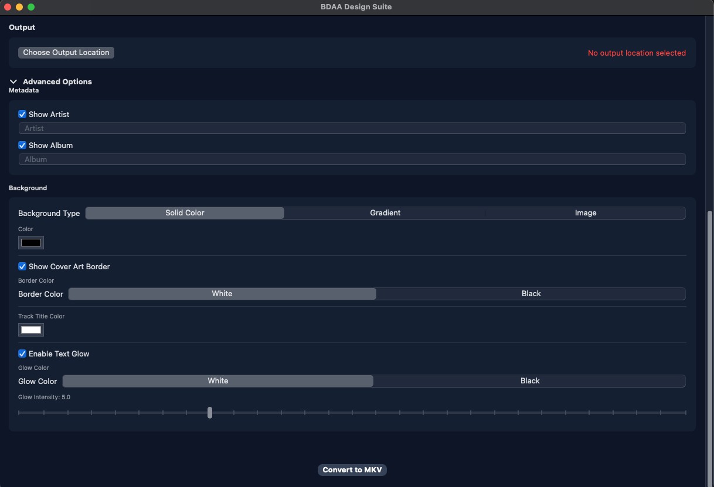
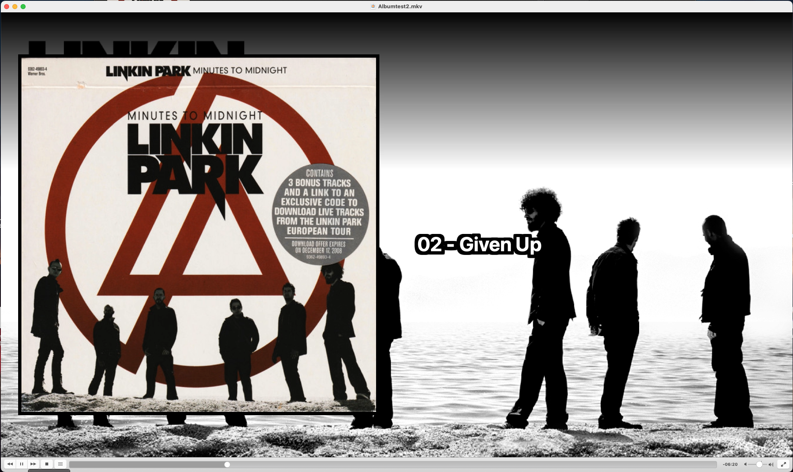

# BDAA Design Suite - FLAC to MKV Converter

A professional macOS application that converts FLAC audio files into MKV video format optimized for Blu-ray audio discs. Each FLAC file becomes a chapter in the MKV with a widescreen video showing album artwork and track information while preserving original audio quality.

## Features

- **Preserves Audio Quality**: Maintains original bit depth and sample rate (24-bit/192kHz, etc.)
- **Chapter Support**: Each track becomes a separate chapter in the MKV with precise timing
- **Widescreen Video**: Creates 1920x1080 video with album art on left and track info on right
- **Metadata Extraction**: Automatically extracts track titles from FLAC files
- **Advanced Customization**: Extensive options for backgrounds, borders, text effects, and more
- **Native macOS App**: Built with SwiftUI for optimal performance and integration

## How It Works

The application creates a visual representation for each FLAC audio track by:

1. **Extracting metadata** from FLAC files (track titles, duration, etc.)
2. **Generating video frames** with album artwork and track information
3. **Creating individual video segments** for each track using FFmpeg
4. **Combining segments** into a single MKV file with chapter markers
5. **Preserving audio quality** by copying the original FLAC data without re-encoding

## Basic Usage

### Required Files
- **FLAC Files**: Select your audio tracks using "Select FLAC Files"
- **Cover Art**: Choose album artwork (JPG, PNG, etc.) using "Select Cover Art"
- **Output Location**: Choose where to save your MKV file using "Choose Output Location"

### Simple Conversion
1. Load your FLAC files and cover art
2. Choose an output location
3. Click "Convert to MKV"
4. Wait for processing to complete

## Advanced Options

Click "Advanced Options" to access extensive customization features:

### Metadata Options
- **Show Artist**: Toggle to display/hide artist information in videos
- **Show Album**: Toggle to display/hide album information in videos
- **Custom Fields**: Override metadata with custom artist and album names

### Background Customization
- **Solid Color**: Choose any solid background color
- **Gradient**: Create custom gradients with start and end colors
- **Image**: Use custom background images that scale to fill the frame

### Visual Effects
- **Cover Art Border**: Add white or black borders around album artwork
- **Track Title Color**: Customize the color of track title text
- **Text Glow**: Add white or black glow effects around text with adjustable intensity

## Technical Specifications

### Video Output
- **Resolution**: 1920x1080 (Full HD)
- **Codec**: H.264 (libx264)
- **Frame Rate**: 1 fps (static image)
- **Quality**: CRF 18 (high quality)

### Audio Processing
- **Codec**: Original FLAC data (copied without re-encoding)
- **Preserves**: Bit depth, sample rate, channel count
- **Supports**: Up to 32-bit/384kHz audio

### Chapter Structure
- Each FLAC file becomes one chapter with precise timing
- Chapter titles use track names from metadata
- Perfect for Blu-ray authoring software compatibility

## Output Example

The resulting MKV file creates professional-looking videos like this:

Each track displays:
- Album artwork on the left side
- Track title prominently displayed
- Optional artist and album information
- Customizable backgrounds and visual effects
- High-quality audio preservation

## System Requirements

- **macOS**: 11.5 or later
- **FFmpeg**: Required for video processing
  - Install with: `brew install ffmpeg`
- **Storage**: Sufficient space for temporary files during processing

## Installation

1. Download the BDAA Design Suite application
2. Install FFmpeg: `brew install ffmpeg`
3. Launch the application
4. Grant necessary file access permissions when prompted

## File Organization Tips

- Name FLAC files with track numbers for proper ordering (e.g., "01 - Song Title.flac")
- Use high-quality album artwork (at least 1000x1000 pixels recommended)
- Ensure FLAC files have proper metadata (title, artist, album, track number)

## Troubleshooting

### Common Issues

**"FFmpeg not found" error:**
- Install FFmpeg using Homebrew: `brew install ffmpeg`
- Restart the application after installation

**Long processing times:**
- Processing time depends on number of tracks and total duration
- Large albums may take 10-30 minutes to process
- Ensure sufficient disk space for temporary files

**Audio quality concerns:**
- The application copies audio without re-encoding to preserve quality
- Check original FLAC file properties to verify they match MKV output

### Getting Help
- Verify all required files are selected and accessible
- Ensure sufficient disk space for temporary files
- Try with a single track first to test your setup

## Perfect for Blu-ray Audio

The resulting MKV files are optimized for:
- Blu-ray authoring software
- Chapter navigation in media players
- High-quality audio preservation
- Professional presentation standards

Create stunning Blu-ray audio discs that showcase your music collection with visual elegance and pristine audio quality.

---

**BDAA Design Suite** - Professional Audio Tools for macOS